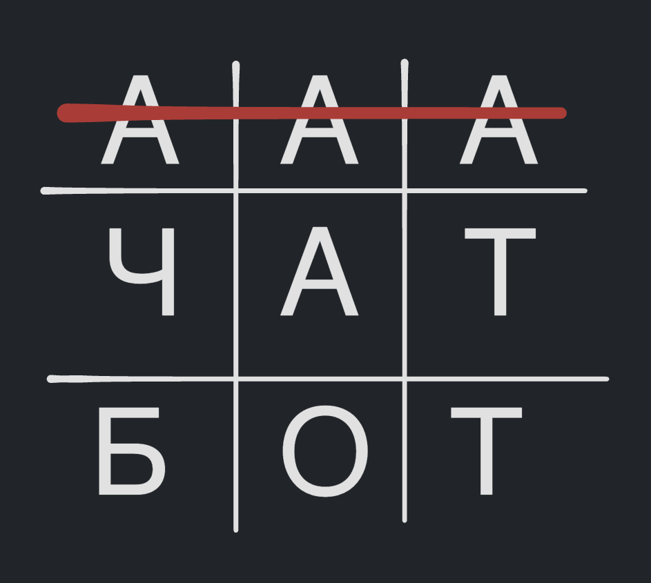

# tic-tac-toe

[Telegram-bot](https://t.me/tictactoe48573bot) (unlikely to be online)

## How to run

- clone the repository
- `pip install .`
- `TIC_TAC_TOE_TOKEN_TG=token app` (entry point) or `python -m tic_tac_toe.bot`

## TODO

- [x] Write game logic (game.py)
- [x] Make tests for game (no tests for bot I think?)
- [x] Understand why grid is smaller before any move (add fix it)
- [x] Add bot logic
- [x] Understand `python-telegram-bot` architecture (`update`, `context`)
- [x] Add multiplayer
- [x] Refactor project (single main script, structured code)
- [x] Make better exception hierarchy
- [x] Make use of marks (singleplayer only)
- [ ] Add some description, annotations, docstrings
- [ ] Make code more readable
- [ ] Create more interesting text (pictures, gif?)
- [x] Linters

## Ideas

- Modify a game so you can rewrite or clear opponent's choice (crazy actually, but no need to change bot.py, only game.py)
- (Done) Make a bot with unbeatable minimax strategy
- ([It is complicated](https://github.com/python-telegram-bot/python-telegram-bot/issues/1907), and I didn't make it work) Add inactivity checker (`context.job_queue.run_once`)
