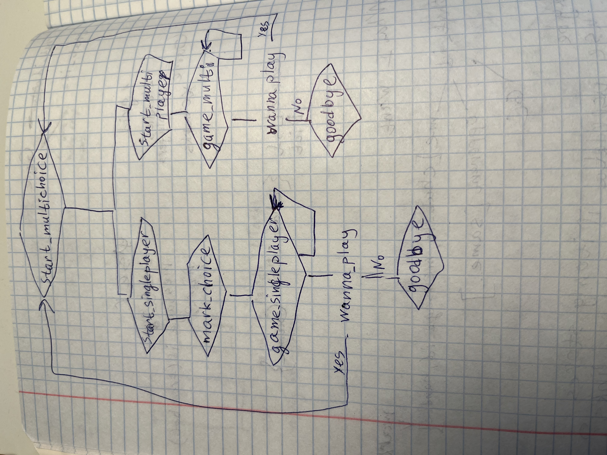

# tic-tac-toe

[Telegram-bot](https://t.me/tictactoe48573bot) (unlikely to be online, but you can easily run your own bot)

This is a Telegram bot for playing Tic Tac Toe game.

Your options:
1. Learn rules sending `/rules` command
2. Start playing using `/start` command
   1. An option for singleplayer
   2. An option for multiplayer
3. Follow commands, they will be updated accordingly
4. When lost, send `/start`. Any current game will be dropped.

## How does it work

1. It uses `ConversationHandler` for all messages
2. For singleplayer it is easier, because bot always reacts to user, and there is a path from `start_multichoice` to `wanna_play` in ConversationHandler
3. But for multiplayer game you have to receive update from 1 user and update message with inline keyboard for 2 users. So we need shared structures that defined in `multiplayer.py`. Workflow becomes more complicated and a bit hacky.
   1. To connect users you put them in the queue.
   2. If two users are in the queue, you create a pair and a new game. Messages are updated for two users.
   3. On any update you edit messages for two users.
   4. From beginning until the game over bot edits the same message to create an impression of animation, even in different stages (select game, select mark, game start, game result).
4. Bot will edit message with current game if you decide to start abruptly a new game using command `/start`. This way chat is cleaner and there are fewer ways to screw things up.

## How to run

- clone the repository
- `pip install .`
- `TIC_TAC_TOE_TOKEN_TG=token app` (entry point) or `python -m tic_tac_toe.bot`
- TODO: what is the option for rust version?

## Flow diagram of `ConversationHandler`

This diagram is a bit confusing to me, but it is better than nothing.
States of ConversationHandler aren't shown, but hopefully they are not so far away from linked coroutines, and you can deduce them.

## What I have learned

- Refactoring from time to time is useful, because it simplifies your work on another parts.
- Get a bit familiar with Telegram API and `python-telegram-bot` API.
- Static type checkers sometimes overly aggressive and not so useful. But still it is 1000 times better than to have none.
- Manual testing of multiplayer game.
- Multiplayer is way harder than singleplayer, and they don't share much functionality.
- Writing tests for your abstractions makes you believe in them and lets you write more assertive code.
- black, ruff, autoimport relieve unnecessary mental burden. Vim doesn't work in Russian layout, therefore all text is in English.
- Integration of Rust code into Python using Maturin, PyO3

## TODO

- [x] Write game logic (game.py)
- [x] Make tests for game (no tests for bot I think?)
- [x] Understand why grid is smaller before any move (add fix it)
- [x] Add bot logic
- [x] Understand `python-telegram-bot` architecture (`update`, `context`)
- [x] Add multiplayer
- [x] Refactor project (single main script, structured code)
- [x] Make better exception hierarchy
- [x] Make use of marks (singleplayer only)
- [x] Add some description, annotations, docstrings
- [x] Make code more readable
- [x] Linters
- [x] Create more interesting text (good enough, constant)
- [x] Maybe a bit better log messages and tests

## Ideas

- Modify a game so you can rewrite or clear opponent's choice (crazy actually, but I hardly need to change bot.py thanks to layer independence, mostly game.py)
- (Done) Make a bot with unbeatable minimax strategy
- ([It is complicated](https://github.com/python-telegram-bot/python-telegram-bot/issues/1907), and I didn't make it work) Add inactivity checker (`context.job_queue.run_once`)
